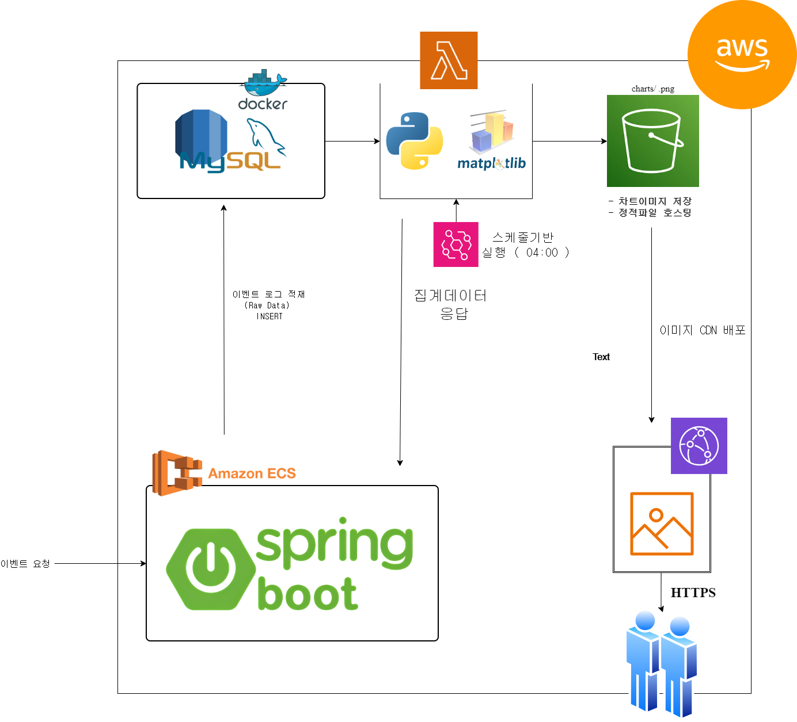

# Event Pipeline

## 실행 방법

```bash
# 1. Docker 컨테이너 실행 (MySQL + Spring Boot 앱)
docker-compose up -d

# 2. 앱이 완전히 올라올 때까지 대기 후 API 확인
curl http://localhost:8080/api/events/analytics

# 3. 시각화 (Python 3.0 이상)
pip install matplotlib requests
python visualize.py
# → charts/analytics_summary.png가 생성됩니다.
```

- 앱 시작 시 `DataInitRunner`가 157개의 샘플 이벤트를 자동 생성하고, 집계 결과를 콘솔에 출력합니다.
- 종료: `docker-compose down`

## 스키마 설명

### events 테이블

| 컬럼 | 타입 | 설명 |
|---|---|---|
| `id` | BIGINT (PK, AUTO_INCREMENT) | 기본키 |
| `event_type` | VARCHAR (ENUM) | PAGE_VIEW, EXPENSE_CREATED, EXPENSE_REVIEWED, ERROR |
| `user_id` | VARCHAR | 유저 식별자 |
| `session_id` | VARCHAR | 세션 UUID |
| `screen_name` | VARCHAR | 화면 이름 |
| `amount` | DECIMAL | 지출 금액 (EXPENSE_CREATED만 사용) |
| `error_message` | VARCHAR | 에러 메시지 (ERROR만 사용) |
| `created_at` | DATETIME | 생성 시각 |

### 이렇게 설계한 이유

모든 이벤트 타입을 하나의 테이블에 저장하는 **단일 테이블 전략**을 선택했습니다.
이벤트 타입별로 테이블을 분리하면 타입 간 집계(전체 이벤트 수, 에러 비율 등)에 JOIN이 필요해지고 스키마가 복잡해집니다.
단일 테이블로 두면 `GROUP BY event_type` 하나로 모든 집계를 처리할 수 있고, `amount`와 `error_message`는 해당 타입에서만 값이 들어가므로 nullable로 두어 공간 낭비를 최소화했습니다.

## 구현하면서 맞닥드린 문제 상황과 고민한 점

- **JPQL projection 매핑 문제**: Spring Data JPA에서 인터페이스 기반 projection을 사용할 때, `SELECT` 절의 alias와 인터페이스의 getter 이름이 정확히 일치하지 않으면 `null`이 반환되는 문제를 겪었습니다. 예를 들어 `COUNT(e) AS count`로 작성해야 `getCount()`와 매핑되는데, alias를 누락해서 디버깅에 시간을 썼습니다.
- **에러 비율 계산**: 처음에는 JPQL 서브쿼리로 에러 비율을 한 번에 계산하려 했으나, JPA에서 `FROM` 절 서브쿼리를 지원하지 않아 서비스 레이어에서 `countAllByEventType(ERROR) / count()`로 나누어 계산하는 방식으로 변경했습니다.
- **시각화 차트 선택**: 시간대별 추이 차트는 샘플 데이터가 동시에 생성되어 의미 있는 분포가 나오지 않으므로 제외하고, 실제 인사이트를 줄 수 있는 4개 차트(타입별 횟수, 유저별 횟수, 에러 비율, 에러 메시지 빈도)에 집중했습니다.
- **이벤트 개수 변경**: 기존 100건에서는 ERROR 16건 = 16.00%로 바로 읽혀서 비율 집계의 의미가 희석되었습니다. 157건으로 변경하면 직관적으로 환산이 어려워지므로 에러 비율 집계의 존재 이유가 명확해집니다.
- **MySQL 선택 이유**: 집계/필터링 쿼리를 SQL로 직접 수행하기 위해 RDBMS가 필요했고, PostgreSQL보다 사용 경험이 많아 빠르게 구성할 수 있다고 판단했습니다.

---

## Step 1. 이벤트 생성기

### 이벤트 타입 설계

제가 현재 운영중인 서비스에서 자주 발생하는 4가지 이벤트를 기반으로 설계했습니다.

| 이벤트 타입 | 설명       | 비고 |
|---|----------|---|
| `PAGE_VIEW` | 화면 조회    | 가장 빈번한 기본 행동 로그 |
| `EXPENSE_CREATED` | 지출 기록    | 핵심 비즈니스 액션, `amount` 필드 포함 |
| `EXPENSE_REVIEWED` | 소비 회고 작성 | 사용자 참여도를 측정할 수 있는 이벤트 |
| `ERROR` | 오류 발생    | 서비스 안정성 모니터링용, `errorMessage` 필드 포함 |

### 설계 의도

- **PAGE_VIEW**: 유저 트래픽과 화면별 방문 빈도를 분석하기 위한 기본 이벤트
- **EXPENSE_CREATED**: 현재 운영 중인 지출관리 서비스의 핵심 액션으로, 실제 전환율과 직결되는 이벤트(분석 단계에서 총 지출액, 평균 지출액 등을 산출가능)
- **EXPENSE_REVIEWED**: 단순 기록을 넘어 사용자가 소비를 돌아보는 행동을 추적
- **ERROR**: 서비스 장애와 오류 패턴을 파악하기 위한 이벤트

## Step 2. 로그 저장

- MySQL(Docker)에 JPA 엔티티로 필드를 컬럼별로 분리하여 저장
- 스키마 및 설계 이유는 상단 [스키마 설명](#스키마-설명) 참고

---

## Step 5. 결과 시각화


---

## AWS 아키텍처 설계

### 구성도



### 사용 서비스 및 선택 이유

| AWS 서비스 | 역할 | 선택 이유                                                                                                   |
|---|---|---------------------------------------------------------------------------------------------------------|
| **Amazon ECS** | Spring Boot 앱 실행 (이벤트 생성 + API 서버) | 현재 Docker 기반으로 구성되어 있어 컨테이너 이미지를 그대로 배포할 수 있습니다                                                         |
| **EC2 + Docker MySQL** | 이벤트 raw data 저장 | Docker 파일을 활용하여 서버에 대한 버젼 정의를 하여 버젼이 바뀔 때, 번거롭게 업데이트 명령어를 사용할 필요없이 Docker 파일만 변경하여 독립적인 환경을 구성하기 적합합니다. |
| **AWS Lambda** | Python 시각화 스크립트 실행 | 하루 1회 실행되는 배치 작업이라 상시 서버가 불필요하고, 실행 시에만 과금되어 비용 효율적입니다                                                  |
| **Amazon EventBridge** | 스케줄러 (매일 새벽 4시 Lambda 트리거) | -                                                                                                       |
| **Amazon S3** | 시각화 이미지(차트 PNG) 저장 및 정적파일 호스팅 | 정적 파일 저장에 최적화되어 있고, 버저닝으로 일별 스냅샷 관리가 가능합니다                                                              |
| **Amazon CloudFront** | S3 접근 제어 및 HTTPS 제공 | S3 버킷을 퍼블릭으로 열지 않고 CloudFront를 통해서만 접근하도록 제한하여 보안을 확보합니다 |

### 각 서비스의 역할 차이

**컴퓨팅: ECS vs Lambda**
- ECS는 Spring Boot처럼 항상 떠 있어야 하는 API 서버를 실행하는 용도로 사용했습니다. 요청이 들어올 때마다 응답해야 하므로 상시 가동이 필요합니다.
- Lambda는 시각화 스크립트처럼 특정 시점에 한 번 실행되고 끝나는 작업에 적합합니다. 실행 시간만큼만 과금되므로 하루 1회 배치에 상시 서버를 유지하는 것보다 비용을 절약할 수 있습니다.

**데이터 저장: EC2(Docker MySQL) vs S3**
- EC2 위의 Docker MySQL은 이벤트 로그를 저장하고, SQL로 집계/필터링 쿼리를 수행합니다. RDS를 사용하지 않고 EC2에서 Docker로 MySQL을 직접 띄우는 방식을 선택한 이유는, 로컬 환경(docker-compose)과 동일한 구성을 유지할 수 있고 DB 설정을 자유롭게 제어할 수 있기 때문입니다.
- S3는 생성된 차트 이미지(PNG)를 저장합니다. 데이터베이스처럼 쿼리하는 것이 아니라 파일을 올리고 URL로 접근하는 방식입니다.

**네트워킹: CloudFront**
- S3 버킷을 퍼블릭으로 직접 공개하지 않고, CloudFront를 통해 접근을 제한합니다. 이벤트 로그 분석은 내부 관리자만 사용하는 분석 대시보드일 확률이 높으므로 불필요한 외부 노출을 막고 안전한 접근만 허용하기 위해 선택했습니다.

### 설계 시 가장 고민한 부분

**시각화 처리를 어디서 실행할 것인가**가 가장 큰 고민이었습니다.

현재 파이프라인에서 시각화는 Python(Matplotlib)으로 처리하고 있는데, 이를 AWS에서 실행하는 방법이 여러 가지 있었습니다:

1. **ECS 안에서 Spring Boot와 함께** — 하나의 컨테이너에서 Python 프로세스를 호출하는 방식입니다. 구성은 간단하지만 Java 앱과 Python 환경이 섞여 컨테이너가 무거워지고, 시각화 실패가 API 서버에 영향을 줄 수 있습니다.
2. **별도 ECS Task** — 시각화 전용 컨테이너를 EventBridge로 스케줄 실행하는 방식입니다. 확실한 분리가 가능하지만, 하루 1회 실행에 ECS Task를 쓰는 것은 과한 구성이라고 판단했습니다.
3. **Lambda** — 실행 시에만 자원을 사용하고, EventBridge와 연동이 간단합니다.

그래서 Lambda를 선택했습니다. 시각화 작업은 API를 호출해서 데이터를 받고 차트를 그려 S3에 업로드하는 단순한 흐름이라, Lambda의 15분 제한 안에 충분히 처리 가능하고 상시 서버를 유지할 이유가 없기 때문입니다.
